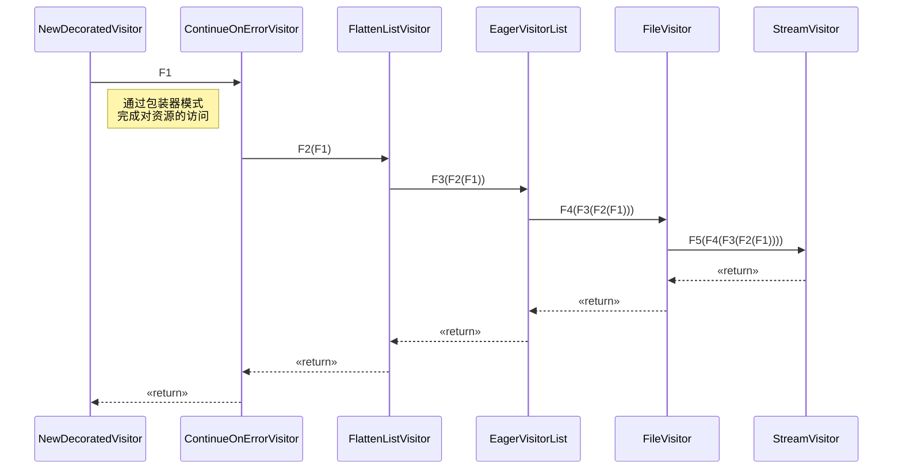

入口文件：
cmd/kubectl/kubectl.go

代码分支：`release-1.15`

# root命令初始化
这里的root命令就是`kubectl`命令本身，底层依赖的是cobra包创建命令。

创建命令的链路：

NewDefaultKubectlCommand --> NewDefaultKubectlCommandWithArgs --> NewKubectlCommand

在`NewKubectlCommand`里首先是用cobra创建一个基本的`kubectl`命令：

```go
cmds := &cobra.Command{
		Use:   "kubectl",
		Short: i18n.T("kubectl controls the Kubernetes cluster manager"),
		Long: templates.LongDesc(`
      kubectl controls the Kubernetes cluster manager.

      Find more information at:
            https://kubernetes.io/docs/reference/kubectl/overview/`),
		Run: runHelp,
		// Hook before and after Run initialize and write profiles to disk,
		// respectively.
		PersistentPreRunE: func(*cobra.Command, []string) error {
			return initProfiling()
		},
		PersistentPostRunE: func(*cobra.Command, []string) error {
			return flushProfiling()
		},
		BashCompletionFunction: bashCompletionFunc,
	}
```

我们知道`kubectl`还包含了很多子命令，此时的cmds还没有包含任何其他命令，它是通过命令组的方式进行添加的：

```go
groups := templates.CommandGroups{
		{
            //基本命令
			Message: "Basic Commands (Beginner):",
			Commands: []*cobra.Command{
				create.NewCmdCreate(f, ioStreams),
				expose.NewCmdExposeService(f, ioStreams),
				run.NewCmdRun(f, ioStreams),
				set.NewCmdSet(f, ioStreams),
			},
		},
		{
            //基本命令
			Message: "Basic Commands (Intermediate):",
			Commands: []*cobra.Command{
				explain.NewCmdExplain("kubectl", f, ioStreams),
				get.NewCmdGet("kubectl", f, ioStreams),
				edit.NewCmdEdit(f, ioStreams),
				delete.NewCmdDelete(f, ioStreams),
			},
		},
		{
            //部署命令
			Message: "Deploy Commands:",
			Commands: []*cobra.Command{
				rollout.NewCmdRollout(f, ioStreams),
				rollingupdate.NewCmdRollingUpdate(f, ioStreams),
				scale.NewCmdScale(f, ioStreams),
				autoscale.NewCmdAutoscale(f, ioStreams),
			},
		},
		{
            //集群管理命令
			Message: "Cluster Management Commands:",
			Commands: []*cobra.Command{
				certificates.NewCmdCertificate(f, ioStreams),
				clusterinfo.NewCmdClusterInfo(f, ioStreams),
				top.NewCmdTop(f, ioStreams),
				drain.NewCmdCordon(f, ioStreams),
				drain.NewCmdUncordon(f, ioStreams),
				drain.NewCmdDrain(f, ioStreams),
				taint.NewCmdTaint(f, ioStreams),
			},
		},
		{
            //排错调试命令
			Message: "Troubleshooting and Debugging Commands:",
			Commands: []*cobra.Command{
				describe.NewCmdDescribe("kubectl", f, ioStreams),
				logs.NewCmdLogs(f, ioStreams),
				attach.NewCmdAttach(f, ioStreams),
				cmdexec.NewCmdExec(f, ioStreams),
				portforward.NewCmdPortForward(f, ioStreams),
				proxy.NewCmdProxy(f, ioStreams),
				cp.NewCmdCp(f, ioStreams),
				auth.NewCmdAuth(f, ioStreams),
			},
		},
		{
            //高级命令
			Message: "Advanced Commands:",
			Commands: []*cobra.Command{
				diff.NewCmdDiff(f, ioStreams),
				apply.NewCmdApply("kubectl", f, ioStreams),
				patch.NewCmdPatch(f, ioStreams),
				replace.NewCmdReplace(f, ioStreams),
				wait.NewCmdWait(f, ioStreams),
				convert.NewCmdConvert(f, ioStreams),
				kustomize.NewCmdKustomize(ioStreams),
			},
		},
		{
            //设置命令
			Message: "Settings Commands:",
			Commands: []*cobra.Command{
				label.NewCmdLabel(f, ioStreams),
				annotate.NewCmdAnnotate("kubectl", f, ioStreams),
				completion.NewCmdCompletion(ioStreams.Out, ""),
			},
		},
    }
    //把所有组中的命令添加到root中
    groups.Add(cmds)
```

除了这些命令，还有些其他命令：

```go
cmds.AddCommand(alpha)
cmds.AddCommand(cmdconfig.NewCmdConfig(f, clientcmd.NewDefaultPathOptions(), ioStreams))
cmds.AddCommand(plugin.NewCmdPlugin(f, ioStreams))
cmds.AddCommand(version.NewCmdVersion(f, ioStreams))
cmds.AddCommand(apiresources.NewCmdAPIVersions(f, ioStreams))
cmds.AddCommand(apiresources.NewCmdAPIResources(f, ioStreams))
cmds.AddCommand(options.NewCmdOptions(ioStreams.Out))
```

# 命令执行

接下来调用`command.Execute()`执行命令。

我们以`kubectl create -f kubia_luksa.yaml`为例进行说明。

>kubia_luksa.yaml文件来源于kubernetes in action书中例子。

>在研究过程中用到了delve进行debug：`dlv debug cmd/kubectl/kubectl.go -- create -f ~/kubia_luksa.yaml`。

根据在`命令初始化`过程的讲解，可以知道`create`子命令会在`pkg/kubectl/cmd/create/create.go:114`执行。

```go
cmd := &cobra.Command{
		Use:                   "create -f FILENAME",
		DisableFlagsInUseLine: true,
		Short:                 i18n.T("Create a resource from a file or from stdin."),
		Long:                  createLong,
		Example:               createExample,
		Run: func(cmd *cobra.Command, args []string) {
			if cmdutil.IsFilenameSliceEmpty(o.FilenameOptions.Filenames, o.FilenameOptions.Kustomize) {
				ioStreams.ErrOut.Write([]byte("Error: must specify one of -f and -k\n\n"))
				defaultRunFunc := cmdutil.DefaultSubCommandRun(ioStreams.ErrOut)
				defaultRunFunc(cmd, args)
				return
			}
			cmdutil.CheckErr(o.Complete(f, cmd))
			cmdutil.CheckErr(o.ValidateArgs(cmd, args))
			//create命令执行入口
			cmdutil.CheckErr(o.RunCreate(f, cmd))
		},
	}
```

232~240行通过构造器模式构造了一个result对象：

```go
//创建resource.Builder对象
r := f.NewBuilder().
	Unstructured().
	//设置schema校验器
	Schema(schema).
	//设置continueOnError=true，尽可能多的加载对象
	ContinueOnError().
	//设置名字空间
	NamespaceParam(cmdNamespace).DefaultNamespace().
	//设置文件参数（文件路径/地址）
	FilenameParam(enforceNamespace, &o.FilenameOptions).
	//设置标签选择器
	LabelSelectorParam(o.Selector).
	//将对象打平
	Flatten().
	//进行result构造
	Do()
```
`FilenameParam`过程中会对请求中的路径进行解析，因为可以目录后者多个文件，因此会有多个path。

```go
for _, s := range paths {
		switch {
		case s == "-":
			b.Stdin()
		//支持通过url进行创建
		case strings.Index(s, "http://") == 0 || strings.Index(s, "https://") == 0:
			url, err := url.Parse(s)
			if err != nil {
				b.errs = append(b.errs, fmt.Errorf("the URL passed to filename %q is not valid: %v", s, err))
				continue
			}
			b.URL(defaultHttpGetAttempts, url)
		default:
		//目录需要递归
			if !recursive {
				b.singleItemImplied = true
			}
			//解析path
			b.Path(recursive, s)
		}
	}
```

`Path`里会调用`ExpandPathsToFileVisitors`将每个路径包装成`FileVisitor`，`FileVisitor`里又包含了`StreamVisitor`，这个使用了`Visitor`设计模式。最终把Visitor[]赋值给`*Builder.paths`。

DO()首先进行result构建，在`visitByPaths`里可以看到，会把之前创建的FileVisitor[]包装成一个统一的Visitor，最终包装结果如下：

```
NewDecoratedVisitor --> NewFlattenListVisitor --> EagerVisitorList
```

>这个是包装器设计模式，就像java.io包那样。

接下来就是根据之前的在builder里设置的参数构造VisitorFunc，这个就是visit模式里的逻辑啦。

包装好Visitor链后就开始访问：


<!-- 
```mermaid
sequenceDiagram
NewDecoratedVisitor->ContinueOnErrorVisitor
ContinueOnErrorVisitor->NewDecoratedVisitor
``` -->